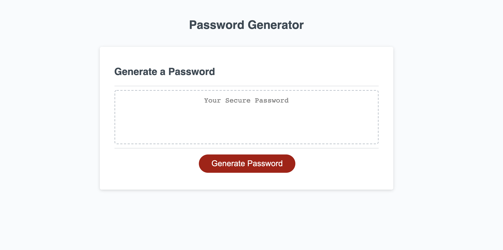

# 03 Password Generator

## Description

This password generator program allows a user to:

- click a button to select from a variety of password preferences
  1. password length (8 - 128 characters)
  2. lowercase letters
  3. uppercase letters
  4. numbers
  5. special characters
- a unique password will display in the box titled "your secure password"
- the unique password will meet all indicated criteria

## Links to repo and page

- Github repository: https://github.com/Sarahlophus/pw.generator
- Github page: https://sarahlophus.github.io/pw.generator/
